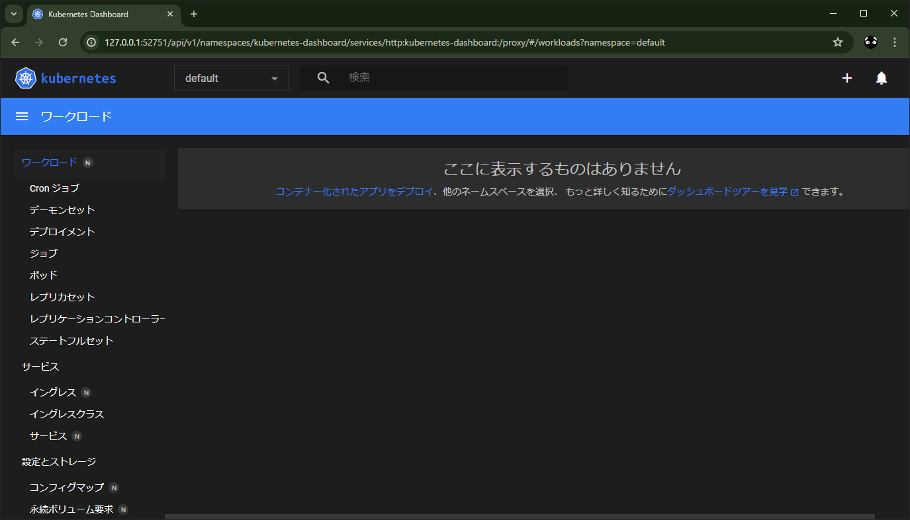
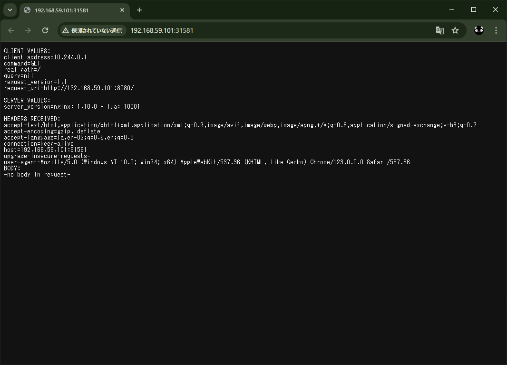

# minikube_virtualbox

https://minikube.sigs.k8s.io/docs/drivers/virtualbox/


minikube のインストール
```
winget install minikube
```
```
> minikube version
minikube version: v1.32.0
commit: 8220a6eb95f0a4d75f7f2d7b14cef975f050512d
```

minikube を virtualbox で起動
```
minikube config set driver virtualbox
minikube delete
minikube start
```

なんか死んだ
```
> minikube start
😄  Microsoft Windows 10 Pro 10.0.19045.4170 Build 19045.4170 上の minikube v1.32.0
✨  ユーザーの設定に基づいて virtualbox ドライバーを使用します
💿  VM ブートイメージをダウンロードしています...
    > minikube-v1.32.1-amd64.iso....:  65 B / 65 B [---------] 100.00% ? p/s 0s
    > minikube-v1.32.1-amd64.iso:  292.96 MiB / 292.96 MiB  100.00% 37.62 MiB p
👍  minikube クラスター中のコントロールプレーンの minikube ノードを起動しています
💾  ロード済み Kubernetes v1.28.3 をダウンロードしています...
    > preloaded-images-k8s-v18-v1...:  403.35 MiB / 403.35 MiB  100.00% 38.45 M
🔥  virtualbox VM (CPUs=2, Memory=4000MB, Disk=20000MB) を作成しています...
❗  この VM は https://registry.k8s.io アクセスにおける問題があります
💡  外部イメージを取得するためには、プロキシーを設定する必要があるかも知れません: https://minikube.sigs.k8s.io/docs/reference/networking/proxy/

❌  RUNTIME_ENABLE が原因で終了します: Failed to enable container runtime: sudo systemctl restart docker: Process exited with status 1
stdout:

stderr:
Job for docker.service failed because the control process exited with error code.
See "systemctl status docker.service" and "journalctl -xe" for details.


╭───────────────────────────────────────────────────────────────────────────────────────────────────╮
│                                                                                                   │
│    😿  上記アドバイスが参考にならない場合は、我々に教えてください:                                │
│    👉  https://github.com/kubernetes/minikube/issues/new/choose                                   │
│                                                                                                   │
│    `minikube logs --file=logs.txt` を実行して、GitHub イシューに logs.txt を添付してください。    │
│                                                                                                   │
╰───────────────────────────────────────────────────────────────────────────────────────────────────╯
```

カンで Hyper-V と WSL 無効化してやり直したら、とりあえずいけた
```
> minikube delete
🔥  C:\Users\user\.minikube\machines\minikube を削除しています...
💀  クラスター「minikube」の全てのトレースを削除しました。
PS C:\Users\user\Desktop\Projects\minikube_virtualbox> minikube start
😄  Microsoft Windows 10 Pro 10.0.19045.4170 Build 19045.4170 上の minikube v1.32.0
✨  ユーザーの設定に基づいて virtualbox ドライバーを使用します
👍  minikube クラスター中のコントロールプレーンの minikube ノードを起動しています
🔥  virtualbox VM (CPUs=2, Memory=4000MB, Disk=20000MB) を作成しています...
❗  この VM は https://registry.k8s.io アクセスにおける問題があります
💡  外部イメージを取得するためには、プロキシーを設定する必要があるかも知れません: https://minikube.sigs.k8s.io/docs/reference/networking/proxy/
🐳  Docker 24.0.7 で Kubernetes v1.28.3 を準備しています...
    ▪ 証明書と鍵を作成しています...
    ▪ コントロールプレーンを起動しています...
    ▪ RBAC のルールを設定中です...
🔗  bridge CNI (コンテナーネットワークインターフェース) を設定中です...
    ▪ gcr.io/k8s-minikube/storage-provisioner:v5 イメージを使用しています
🌟  有効なアドオン: storage-provisioner, default-storageclass
🔎  Kubernetes コンポーネントを検証しています...
💡  kubectl が見つかりません。kubectl が必要な場合、'minikube kubectl -- get pods -A' を試してください
🏄  終了しました！kubectl がデフォルトで「minikube」クラスターと「default」ネームスペースを使用するよう設定されました
```

言われるがまま `minikube kubectl -- get pods -A` を実行  
Minikube 環境で稼働中の全ての Kubernetes Pod の一覧を表示
```
> minikube kubectl -- get pods -A
    > kubectl.exe.sha256:  64 B / 64 B [---------------------] 100.00% ? p/s 0s
    > kubectl.exe:  48.25 MiB / 48.25 MiB [----------] 100.00% 3.53 MiB p/s 14s
NAMESPACE     NAME                               READY   STATUS    RESTARTS   AGE  
kube-system   coredns-5dd5756b68-9wd2m           1/1     Running   0          2m34s
kube-system   etcd-minikube                      1/1     Running   0          2m46s
kube-system   kube-apiserver-minikube            1/1     Running   0          2m46s
kube-system   kube-controller-manager-minikube   1/1     Running   0          2m45s
kube-system   kube-proxy-qrzd9                   1/1     Running   0          2m34s
kube-system   kube-scheduler-minikube            1/1     Running   0          2m49s
kube-system   storage-provisioner                1/1     Running   0          2m43s
```

kubectl をインストール
```
winget install Kubernetes.kubectl
```
```
> kubectl version  
Client Version: v1.29.0
Kustomize Version: v5.0.4-0.20230601165947-6ce0bf390ce3
Server Version: v1.28.3
```

[Hello Minikube](https://kubernetes.io/ja/docs/tutorials/hello-minikube/)

```
minikube dashboard
```
```
> minikube dashboard
🔌  ダッシュボードを有効化しています...
    ▪ docker.io/kubernetesui/dashboard:v2.7.0 イメージを使用しています
    ▪ docker.io/kubernetesui/metrics-scraper:v1.0.8 イメージを使用しています
💡  いくつかのダッシュボード機能は metrics-server アドオンを必要とします。全機能を有効にするためには、次のコマンドを実行します:

        minikube addons enable metrics-server


🤔  ダッシュボードの状態を検証しています...
🚀  プロキシーを起動しています...
🤔  プロキシーの状態を検証しています...
🎉  デフォルトブラウザーで http://127.0.0.1:52751/api/v1/namespaces/kubernetes-dashboard/services/http:kubernetes-dashboard:/proxy/ を開いています...
```



[Deploymentの作成](https://kubernetes.io/ja/docs/tutorials/hello-minikube/#deployment%E3%81%AE%E4%BD%9C%E6%88%90)

```
> kubectl create deployment hello-node --image=registry.k8s.io/echoserver:1.4
deployment.apps/hello-node created
```

```
> kubectl get deployments
NAME         READY   UP-TO-DATE   AVAILABLE   AGE
hello-node   1/1     1            1           25s
```

```
> kubectl get pods       
NAME                          READY   STATUS    RESTARTS   AGE
hello-node-7c97b7fcf5-wmwdw   1/1     Running   0          47s
```

```
> kubectl get events
LAST SEEN   TYPE     REASON                    OBJECT                             MESSAGE
79s         Normal   Scheduled                 pod/hello-node-7c97b7fcf5-wmwdw    Successfully assigned default/hello-node-7c97b7fcf5-wmwdw to minikube
78s         Normal   Pulling                   pod/hello-node-7c97b7fcf5-wmwdw    Pulling image "registry.k8s.io/echoserver:1.4"
70s         Normal   Pulled                    pod/hello-node-7c97b7fcf5-wmwdw    Successfully pulled image "registry.k8s.io/echoserver:1.4" in 7.46s (7.46s including waiting)
70s         Normal   Created                   pod/hello-node-7c97b7fcf5-wmwdw    Created container echoserver
70s         Normal   Started                   pod/hello-node-7c97b7fcf5-wmwdw    Started container echoserver
79s         Normal   SuccessfulCreate          replicaset/hello-node-7c97b7fcf5   Created pod: hello-node-7c97b7fcf5-wmwdw
79s         Normal   ScalingReplicaSet         deployment/hello-node              Scaled up replica set hello-node-7c97b7fcf5 to 1
21m         Normal   NodeHasSufficientMemory   node/minikube                      Node minikube status is now: NodeHasSufficientMemory
21m         Normal   NodeHasNoDiskPressure     node/minikube                      Node minikube status is now: NodeHasNoDiskPressure
21m         Normal   NodeHasSufficientPID      node/minikube                      Node minikube status is now: NodeHasSufficientPID
21m         Normal   NodeAllocatableEnforced   node/minikube                      Updated Node Allocatable limit across pods
21m         Normal   Starting                  node/minikube                      Starting kubelet.
21m         Normal   NodeHasSufficientMemory   node/minikube                      Node minikube status is now: NodeHasSufficientMemory
21m         Normal   NodeHasNoDiskPressure     node/minikube                      Node minikube status is now: NodeHasNoDiskPressure  
21m         Normal   NodeHasSufficientPID      node/minikube                      Node minikube status is now: NodeHasSufficientPID   
21m         Normal   NodeAllocatableEnforced   node/minikube                      Updated Node Allocatable limit across pods
21m         Normal   NodeReady                 node/minikube                      Node minikube status is now: NodeReady
21m         Normal   RegisteredNode            node/minikube                      Node minikube event: Registered Node minikube in Controller
21m         Normal   Starting                  node/minikube
```

```
> kubectl config view
apiVersion: v1
clusters:
- cluster:
～～～～～～～～～～～～～　略　～～～～～～～～～～～～～～～～
```

[Serviceの作成](https://kubernetes.io/ja/docs/tutorials/hello-minikube/#service%E3%81%AE%E4%BD%9C%E6%88%90)

```
> kubectl expose deployment hello-node --type=LoadBalancer --port=8080
service/hello-node exposed
```

```
> kubectl get services
NAME         TYPE           CLUSTER-IP      EXTERNAL-IP   PORT(S)          AGE
hello-node   LoadBalancer   10.111.178.19   <pending>     8080:31581/TCP   15s
kubernetes   ClusterIP      10.96.0.1       <none>        443/TCP          23m
```

```
> minikube service hello-node
|-----------|------------|-------------|-----------------------------|
| NAMESPACE |    NAME    | TARGET PORT |             URL             |
|-----------|------------|-------------|-----------------------------|
| default   | hello-node |        8080 | http://192.168.59.101:31581 |
|-----------|------------|-------------|-----------------------------|
🎉  デフォルトブラウザーで default/hello-node サービスを開いています...
```




[クリーンアップ](https://kubernetes.io/ja/docs/tutorials/hello-minikube/#%E3%82%AF%E3%83%AA%E3%83%BC%E3%83%B3%E3%82%A2%E3%83%83%E3%83%97)

```
> kubectl delete service hello-node
service "hello-node" deleted
> kubectl delete deployment hello-node
deployment.apps "hello-node" deleted
```